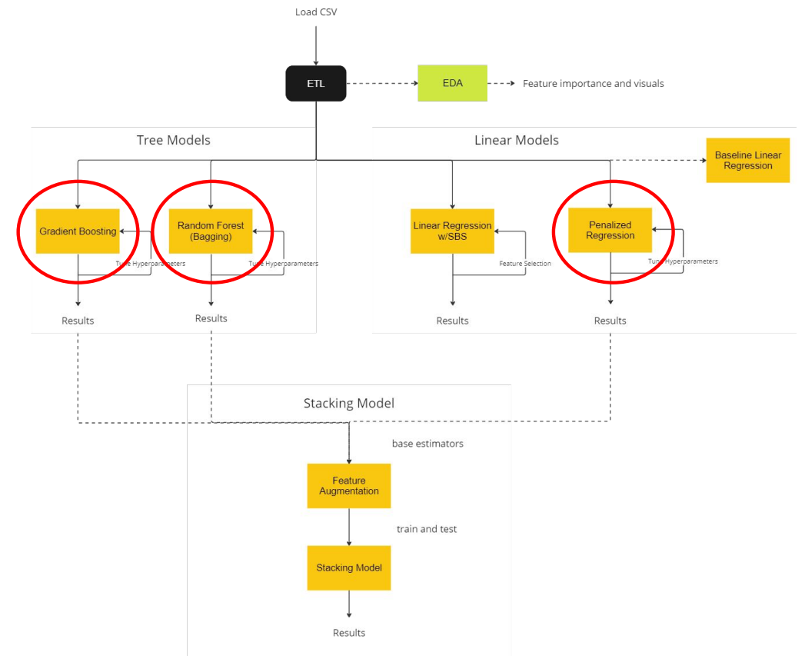
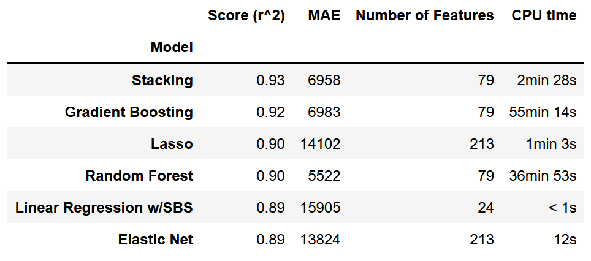

## Ames Housing Price Predictions
The goal of this project is to explore feature importance toward local home sales price within a dataset from Ames, Iowa and then explore/develop a machine learning model that maximizes accuracy. Linear/tree regression modeling, hyperparameter optimization and ensemble/stacking methods were modeled and compared.
ff 

[project presentation PDF link](ml_project_presentation.pdf)

### ML Workflow

### Modeling Results

